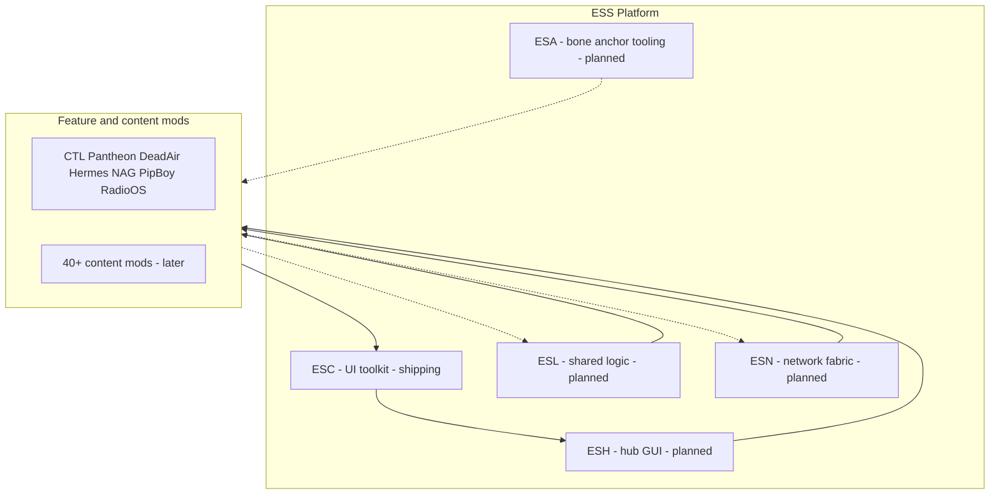
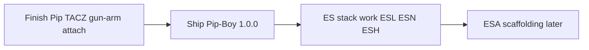
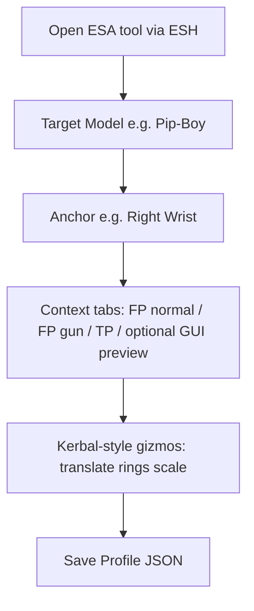
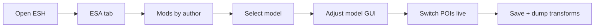

# ESS Framework — Extra Special Studio platform

**Studio:** [ESS] Extra Special Studio — [extraspecialstudio.co.uk](https://extraspecialstudio.co.uk)

This document describes the modular platform stack for Minecraft mods and the parallel naming for future Unity games. **ESC is shipping today.** ESH / ESL / ESN / ESA are planned; none of those four are implemented yet.

---

## Platform mods (Minecraft)

| Mod | ID (working) | Status | Role | Boundary |
|-----|--------------|--------|------|----------|
| **ESC** — Extra Special Core | `extraspecialcore` | Shipping | UI toolkit, fonts, anchor layout | Rendering + interaction only; no gameplay logic |
| **ESH** — Extra Special Hub | `extraspecialhub` | Planned | One hotkey hub GUI; tab slots for CTL / Pantheon / Dead Air / etc.; third-party window injection | Shell + registration; feature mods own tab content |
| **ESL** — Extra Special Library | `extraspeciallibrary` | Planned | Shared config helpers, formatting, reusable non-UI components | Build once, reuse everywhere; no mod-specific rules |
| **ESN** — Extra Special Network | `extraspecialnetwork` | Planned | Cross-mod comms, sync, channel lifecycle | Ecosystem fabric; not marketed as a miracle packet-fixer |
| **ESA** — Extra Special Anchor | `extraspecialanchor` | Planned / not started | Live bone-anchored model transform editor + saveable profiles | Dev/tooling (optional runtime profile apply); not a content mod |



---

## Priority sequencing

Near-term order (do not skip ahead to ESA or full ES scaffolding while Pip is unfinished):



1. **Finish Pip on TACZ gun arm** — **DONE / all POIs LOCKED 2026-08-09** (see TRANSFORM_LOG.md)  
2. **Ship Pip-Boy Radio Conversion 1.0.0**  
3. **Resume ES stack** — ESL / ESN / ESH scaffolding and flagship wiring  
4. **ESA later** — import Pip TRANSFORM_LOG seed profiles; after the core stack  

---

## Why separate mods

- **Clear jobs** — UI, hub shell, shared logic, networking, and anchor tooling stay separable
- **CurseForge** — distinct downloads; users install only what they need
- **Optional deps** — feature mods declare ESL/ESN/ESA as optional where appropriate

## Why before 40+ content mods

Rewiring flagship mods into the stack now beats rewiring everything later. Goal: faster mod development and a platform third-party mods can plug into.

---

## Package naming

| | Java / Maven |
|--|--------------|
| **Domain** | `extraspecialstudio.co.uk` |
| **Maven group / Java root** | `uk.co.extraspecialstudio` |
| **ESC Java** | `uk.co.extraspecialstudio.extraspecial.*` |
| **Consumers** | `uk.co.extraspecialstudio.<modleaf>.*` (e.g. `dead_air`, `hermes`) |

`mod_id` values stay stable across package renames so worlds and item IDs are not broken.

---

## Extensibility

The stack may grow with additional `[ESX] Extra Special {Name}` modules (e.g. audio, persistence, auth). Convention:

- Stable public APIs with semver
- Migration notes per release
- Content packs (soundtracks, datapacks) stay **thin** — off the stack, optional ESL/ESN deps only

---

## ESA — Extra Special Anchor (future)

**Status:** Idea only. No Gradle project, APIs, or UI yet.  
**Working id:** `extraspecialanchor`  
**North star (2026-08-09):** Kerbal-style in-game transform tools for player-bound models — select → tweak live → save profile.

### One sentence

ESA turns model positioning from a **guess → compile → relaunch → repeat** loop into a **30-second drag-and-save** task.

### Problem

Blockbench Display settings are a **static preview** (“make it look right on a fake arm”). Minecraft applies **dynamic transforms every frame**. Mods like TACZ **override arm animations**, so vanilla/Blockbench offsets no longer line up.

The Pip-Boy case made this concrete:

- Geo / mesh orientation can be correct
- Empty-hand / vanilla FP can look fine
- TACZ gun FP still misaligns because the Pip is parented to an overridden support-arm matrix
- TP vs gun FP can need **different** LCD paint and model flips even for the “same” cuff

Manual offsets work, but they force a reload nudge loop against a moving target. That pain is the design brief.

### Purpose

| Without ESA | With ESA |
|-------------|----------|
| move `0.01` → compile → launch → check → wrong → ×200 | nudge live while the real arm/gun anim plays → **Save Profile** |

The live in-game editor is the headline (“magical” fix people feel). Saved profiles + export are what make a tuned pose shippable as defaults — including **right wrist** mirrors once left is dialed.

### Product vision — Kerbal-style flow



1. Open **ESA** (ESH tab)  
2. **Target Model** → e.g. Pip-Boy  
3. **Anchor** → e.g. Right Wrist (or Left Wrist, custom bone, etc.)  
4. ESA shows **per-view contexts** side by side / as tabs:
   - FP (normal / empty)
   - FP (with gun / TACZ)
   - TP
   - GUI preview (optional)
5. **Gizmos** (Kerbal Transform Tools feel):
   - Translate axes (X / Y / Z) with clear local-axis dictionary per parent
   - Rotation rings
   - Scale (when needed)
6. Nudge until it looks right **in that context**  
7. **Save Profile** → writes config/JSON linked to `modelId` + `anchor` + `context` (+ optional `hostAnim` profile set)

#### Killer feature: per-context transforms

Not one pose per model — a matrix:

```yaml
RightWrist:
  FP_Normal:  { pos: [x,y,z], rot: [x,y,z], scale: s, lcdPaintDegrees?: n }
  FP_TACZ:    { pos: [x,y,z], rot: [x,y,z], scale: s, lcdPaintDegrees?: n }
  TP:         { pos: [x,y,z], rot: [x,y,z], scale: s, lcdPaintDegrees?: n }
```

Same model, **mirrored or re-anchored** to the other wrist = new anchor + copy/adapt profile (the “boom, right wrists too” outcome).

#### Sleeper feature: profiles per animation host

Named profile sets ESA can auto-switch:

- `Default` / `vanilla`
- `TACZ`
- Other gun / animation mods

Switch based on **what animation system is active**, not a player menu hunt.

### What this eliminates

The entire Pip-class nightmare loop: tiny constant edits, rebuild, relaunch, wrong axis dictionary, LCD compensating for an upside-down model, TP and gun FP fighting over one live texture.

### Who else wins (god-tier scope)

Same tool solves alignment for:

- Curios / worn accessories  
- Weapon attachment alignment  
- Armor overlays  
- Custom animation compatibility  
- Any player-bound model that must parent to a **final** PoseStack bone

### Target workflow (ESH + ESA) — operator steps



1. Open **ESH** → **ESA** tab  
2. Browse **installed mods**, grouped by **author**  
3. Open a mod → select a **model** → **Adjust model**  
4. Live GUI: move / rotate / scale on the **player in-world** while animations play  
5. Switch **POIs** (points of interest / contexts) to capture each variant without leaving the editor  
6. **Save** → ESA lists the rendering / transform details (copyable dump)  
7. Hand that dump to tooling / an AI assistant / a PR so it becomes the **default POI** for that context  

POIs are first-class: not one transform per model, but a small matrix of runtime contexts the game (and ESA) can detect.

### Planned features

1. **Live transform editor** — Kerbal-style gizmos; primary loved surface  
2. **True bone anchoring** — attach to final runtime PoseStack (arm, wrist, custom anchors), not Display-tab preview space  
3. **POI / profile system** — save offsets per item, POI (FP / TP / override), anchor side, and host mod  
4. **Compatibility layer** — detect animation overrides; ship alignment profiles instead of one-off hacks  
5. **One-click export** — convert in-game positioning to code-ready / shareable transform dumps  
6. **LCD / screen-paint knobs** (where relevant) — per-POI paint rotate so model flip and atlas paint stay separate (Pip lesson)

### Distribution of defaults (two paths)

1. **Studio / community defaults** — authors (or players) save a model in position, send the transform data via a dedicated GitHub repo; ESS merges curated defaults as ESA updates  
2. **Author API** — mods call into ESA to register their own baselines, e.g. conceptually `ESA.registerDefault(modId, modelId, poiId, transform)`, so content mods ship correct attach data without waiting on a central PR  

Both paths share the same profile format so a live tune, a GitHub submission, and an in-mod default are interchangeable.

### First real seed: Dead Air Pip-Boy (manual calibrate → ESA import)

Canonical numbers live in Pip-Boy [`TRANSFORM_LOG.md`](../Dead%20Air%20-%20Pip-Boy%20Radio%20Conversion/TRANSFORM_LOG.md). That file is the pain diary + locked/near-locked POIs that ESA should import first.

| POI | Parent | hostAnim | Notes for ESA |
|-----|--------|----------|----------------|
| `fp_empty_left` | vanilla off-hand FP + injected left arm | `vanilla` | Separate LCD liveId / paint from wrist paths |
| `fp_gun_tacz_left` | TACZ `lefthand_pos` **LEFT** (not RIGHT) | `tacz` | Cancel off-hand item; hook after LEFT arm draw; own LCD paint |
| `tp_left_wrist` | anatomical `leftArm` | `vanilla_tp` | Model orientation ≠ LCD paint; do not share gun-FP live texture |

**Lessons ESA must encode (from Pip):**

- Empty FP, gun FP, and TP **must not share** one live texture / paint rotate when parents differ  
- Per-POI **axis dictionaries** (what “down” means changes by parent)  
- LCD paint can **mask** an upside-down model — editor should show model + screen separately  
- **TACZ:** detect gun → cancel Pip off-hand item → parent to **final** LEFT support-arm PoseStack after TACZ anim → apply POI local offsets  

### Boundary

- ESA is **tooling** (and optionally a thin runtime that applies saved profiles)
- ESA is **not** ESC (ESC stays UI layout only)
- ESA is **not** a content / gameplay mod
- ESA is discovered through **ESH** (ESA tab), not a separate forever-orphan UI
- Implementation deferred until **after Pip-Boy 1.0.0** and **after ESL / ESN / ESH** priority work
- Born from real Pip + TACZ frustration — keep that as the acceptance test, not a slide deck
---

## ESH hub (future MVP sketch)

- `EssHubScreen extends EscScreen` — dock + content area
- `HubTabRegistry.register(modId, title, tabFactory)` at client setup
- Feature mods keep their existing GUIs; ESH hosts them as tabs (thin adapter), not a rewrite
- No hard-coded mod list inside ESH
- **ESA registers as an ESH tab** — mod browser (by author) + adjust flow lives there once ESA exists

---

## Unity parity (future)

Same **module names and roles** for mobile/Steam games:

| Minecraft | Unity analogue |
|-----------|----------------|
| ESC | UI / presentation layer |
| ESL | Shared services, config, helpers |
| ESN | Net/sync fabric |
| ESH | Main menu / hub shell |
| ESA | Runtime attach / live transform tooling |

Brand, contracts, and API **concepts** travel; Minecraft Java code does not.

---

## Discipline

- Keep stack APIs stable; breaking changes require migration docs
- ESN is sold as **ecosystem fabric**, not a universal packet fixer
- Flagship mods register into ESH rather than duplicating hub GUIs
- ESC never absorbs gameplay or mod-specific business rules
- ESA never absorbs content design — only transforms and profiles

---

## Related docs

- [ESC_UI_POLICY.md](ESC_UI_POLICY.md) — mandatory anchoring for ESC consumers
- [ESC_PUBLIC_ROADMAP.md](ESC_PUBLIC_ROADMAP.md) — ESC toolkit roadmap
- [LAYOUT_MIGRATION.md](LAYOUT_MIGRATION.md) — anchor layout migration guide
